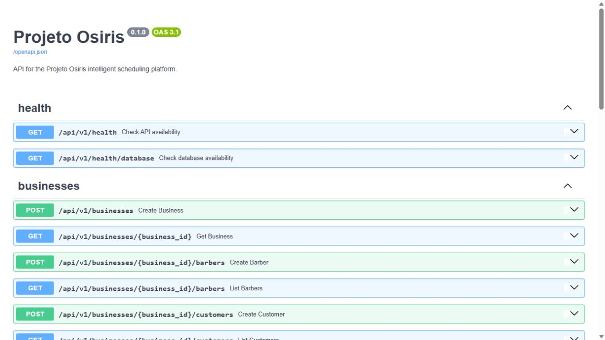
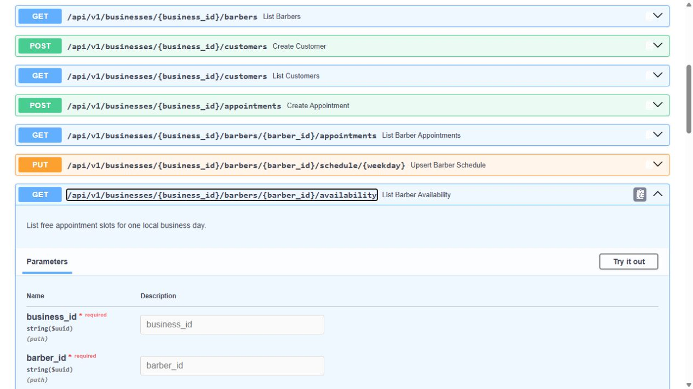
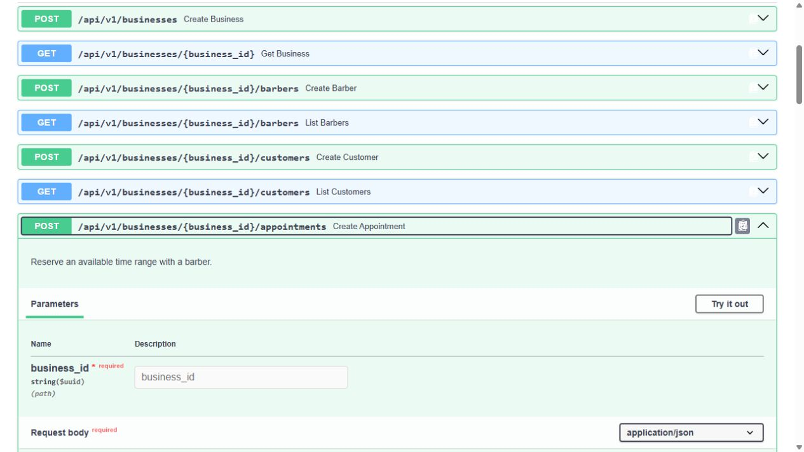

# Projeto Osiris

Plataforma de atendimento e agendamento inteligente, iniciada para barbearias e preparada para evoluir para outros negócios que trabalham com agenda.

O objetivo do Osiris é conectar uma API de agendamentos a um agente de IA capaz de consultar horários, criar reservas e acompanhar o atendimento ao cliente.



## Status atual

O núcleo de agendamento e disponibilidade está funcional. O fluxo completo foi validado pela API:

```text
Horário livre → agendamento criado → horário removido
→ agendamento cancelado → horário liberado novamente
```

A implementação está documentada e coberta por **19 testes automatizados**.

## Funcionalidades implementadas

- Cadastro e consulta de empresas.
- Cadastro e listagem de barbeiros.
- Cadastro e listagem de clientes.
- Criação de agendamentos com validação de referências.
- Proteção contra conflito de horários.
- Consulta da agenda diária de cada barbeiro.
- Confirmação e cancelamento de agendamentos.
- Configuração da jornada semanal por profissional.
- Geração de horários livres em intervalos configuráveis.
- Tratamento de fuso horário por estabelecimento.
- Remoção automática de horários ocupados.
- Liberação automática do horário após cancelamento.
- Documentação interativa com OpenAPI/Swagger.

## Disponibilidade

A jornada de cada profissional é cadastrada por dia da semana. A API transforma essa jornada em intervalos de atendimento e remove os períodos que conflitam com agendamentos ativos (`scheduled` ou `confirmed`). Agendamentos cancelados não bloqueiam a agenda.



Exemplo de configuração para segunda-feira, das 09:00 às 18:00, com atendimentos de 30 minutos:

```http
PUT /api/v1/businesses/{business_id}/barbers/{barber_id}/schedule/0
```

```json
{
  "starts_at": "09:00:00",
  "ends_at": "18:00:00",
  "slot_duration_minutes": 30
}
```

Consulta dos horários livres:

```http
GET /api/v1/businesses/{business_id}/barbers/{barber_id}/availability?appointment_date=2026-09-07
```

Exemplo resumido de resposta:

```json
{
  "appointment_date": "2026-09-07",
  "timezone": "America/Sao_Paulo",
  "slots": [
    {
      "starts_at": "2026-09-07T09:00:00-03:00",
      "ends_at": "2026-09-07T09:30:00-03:00"
    }
  ]
}
```

## Ciclo de vida do agendamento



| Operação | Endpoint | Regra |
| --- | --- | --- |
| Criar | `POST /api/v1/businesses/{business_id}/appointments` | Reserva um intervalo disponível |
| Consultar | `GET /api/v1/businesses/{business_id}/barbers/{barber_id}/appointments` | Lista agendamentos ativos na data |
| Confirmar | `PATCH /api/v1/businesses/{business_id}/appointments/{appointment_id}/confirm` | Permitido para `scheduled` |
| Cancelar | `PATCH /api/v1/businesses/{business_id}/appointments/{appointment_id}/cancel` | Permitido para `scheduled` ou `confirmed` |

Transições inválidas retornam `409 Conflict`; recursos inexistentes retornam `404 Not Found`.

## Arquitetura

O backend segue uma arquitetura em camadas:

```text
Requisição HTTP
    ↓
Rotas FastAPI
    ↓
Services (regras de negócio)
    ↓
Repositories (acesso a dados)
    ↓
PostgreSQL
```

Estrutura principal:

```text
app/
├── api/           # Endpoints e contratos HTTP
├── agents/        # Espaço para os agentes de IA
├── core/          # Configurações e exceções
├── database/      # Sessão e conexão assíncrona
├── integrations/  # Integrações externas
├── models/        # Entidades SQLAlchemy
├── repositories/  # Acesso a dados
├── schemas/       # Contratos Pydantic
└── services/      # Regras de negócio
```

## Tecnologias

- Python 3.12+
- FastAPI e OpenAPI
- PostgreSQL 16
- SQLAlchemy 2 (assíncrono)
- Alembic
- Docker Compose
- Pydantic
- Pytest
- Ruff, Black e MyPy

## Executar localmente

```powershell
Copy-Item .env.example .env
py -3.12 -m venv .venv
.\.venv\Scripts\Activate.ps1
python -m pip install -e ".[dev]"
docker compose up -d db
alembic upgrade head
fastapi dev app/main.py
```

Acesse:

- Swagger: `http://127.0.0.1:8000/docs`
- Health check: `http://127.0.0.1:8000/api/v1/health`
- Banco de dados: `http://127.0.0.1:8000/api/v1/health/database`

## Qualidade

```powershell
pytest
ruff check app tests
black --check app tests
mypy app tests
```

Estado registrado nesta entrega: **19 testes automatizados aprovados**.

## Próximos passos

- Cadastrar jornadas para os demais dias da semana.
- Implementar o agente de IA que consultará a disponibilidade.
- Integrar o atendimento pelo WhatsApp.
- Adicionar autenticação e autorização.
- Evoluir observabilidade, logs e implantação.

## Autor

Desenvolvido por **André** como projeto de portfólio e estudo prático de APIs, arquitetura backend, regras de agendamento e agentes de IA.
