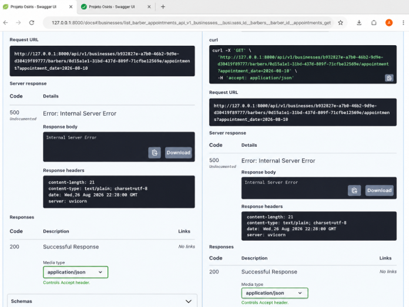
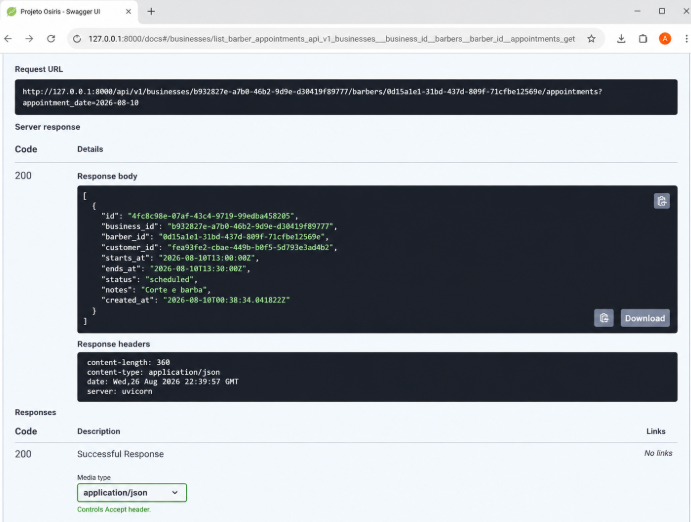

# 🐛 Bug Fix — HTTP 500 na consulta de agendamentos

## 📌 Contexto

Durante os testes da API do **Projeto Osiris**, identifiquei um erro no endpoint responsável por consultar os agendamentos de um barbeiro em uma determinada data.

## ❌ Problema

A requisição:

```http
GET /api/v1/businesses/{business_id}/barbers/{barber_id}/appointments
```

com o parâmetro:

```text
appointment_date=2026-08-10
```

estava retornando:

```text
HTTP 500 — Internal Server Error
```

### 📸 Evidência



---

## 🔎 Investigação

Como a rota estava sendo reconhecida corretamente pelo FastAPI, o problema estava ocorrendo durante o processamento interno da requisição.

A análise do erro indicou que a falha estava relacionada ao tratamento de fusos horários no ambiente Windows.

Durante a investigação, foi verificado que o ambiente virtual do projeto precisava ter suas dependências corretamente instaladas e atualizadas.

---

## 🧩 Causa

O ambiente de desenvolvimento não estava com todas as dependências necessárias corretamente instaladas, causando uma exceção durante uma operação relacionada ao tratamento de timezone.

Como consequência, a aplicação não conseguia concluir a requisição e retornava:

```text
HTTP 500 — Internal Server Error
```

---

## 🔧 Correção

Com a API parada, as dependências do projeto foram reinstaladas/atualizadas utilizando:

```powershell
.\.venv\Scripts\python.exe -m pip install -e .
```

Após a instalação das dependências, a API foi iniciada novamente:

```powershell
.\.venv\Scripts\fastapi.exe dev app/main.py
```

---

## 🧪 Validação

Após a correção, executei novamente a mesma requisição utilizando os mesmos parâmetros.

### ❌ Antes

```text
HTTP 500 — Internal Server Error
```

### ✅ Depois

```text
HTTP 200 — Successful Response
```

A API passou a processar a requisição corretamente e retornar os dados do agendamento em formato JSON.

### 📸 Evidência da correção



---

## 📚 Aprendizados

Durante a investigação e correção desse problema, alguns pontos importantes ficaram evidentes:

- Analisar o traceback antes de realizar alterações no código.
- Nem todo erro `HTTP 500` é causado diretamente pela lógica do endpoint.
- Configuração do ambiente e dependências também fazem parte do funcionamento da aplicação.
- Diferenças entre sistemas operacionais podem afetar o comportamento de determinadas dependências.
- Reproduzir exatamente o mesmo cenário após uma correção é fundamental para validar a solução.
- Documentar bugs e suas soluções cria um histórico técnico útil para manutenção e evolução do projeto.

---

## ✅ Status

**Resolvido — HTTP 500 → HTTP 200**

O endpoint de consulta de agendamentos voltou a funcionar corretamente após a correção do ambiente.
